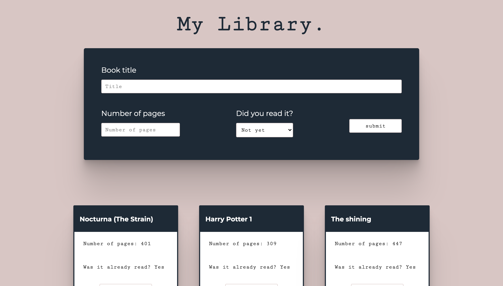

# My Library.

> A project where you can create and destroy cards about books.

 

This project is part of the Microverse curriculum "Javascript." It is made with learning proposes. To practice the creation of objects with constructors and manage basic data from the DOM.
 
Here the user can create cards about books with a simple form. Adding Title, the number of pages, and status of reading.
 
It is also possible to delete the created cards. The project was created using HTML, CSS, Javascript, and the API, LocalStorage.

  

### Prerequisites

- Access to a Terminal. (Basic knowledge on the usage)
- GitHub basic knowledge. (Preferable)
- Visual Studio Code with Live Server extension pre-installed.

## Download this project!

- At first, you have to clone this repository. Open your terminal and paste this without the $ sign. 

      $ git clone https://github.com/AlejandroNo4/library-js.git

- Now that you have the repository in your local machine. Change the direction of the local file with your terminal. Just type "$ cd" (without the $ sign) and the path to reach the library-js folder. 
Something like:

      $ cd User/Documents/ibrary-js

- You are done! Now to open the project on your text editor, just type:

      $ code .

- Once inside, to run the project, right-click on the index.HTML file and click on open with Live Server. 

 

## Live Version

[Live version here!](https://alejandrono4.github.io/library-js/)

 

## Usage

- Open the live version or download the project and use Live Server. ↑

- Click on "Add a new BOOK!"

- Then a form will appear.

- Fill out the fields and click on "submit."

- Notice that your info appears now in a "card."

- You can delete a card by clicking on "Delete."

## Built With

- Javascript
- VS Code
- Git
- LocalStorage

## Authors

👤 **Author1**

- GitHub: [@AlejandroNo4](https://github.com/AlejandroNo4)
- Twitter: [@Alejand80002666](https://twitter.com/Alejand80002666)
- LinkedIn: [Alejandro Contreras Rodriguez](https://www.linkedin.com/in/alejandro-contreras-rodriguez-b524821b5)

## 🤝 Contributing

Contributions, issues, and feature requests are welcome!

Feel free to check the [Issues page](https://github.com/AlejandroNo4/library-js/issues).

## Show your support

Give a ⭐️ if you like this project!